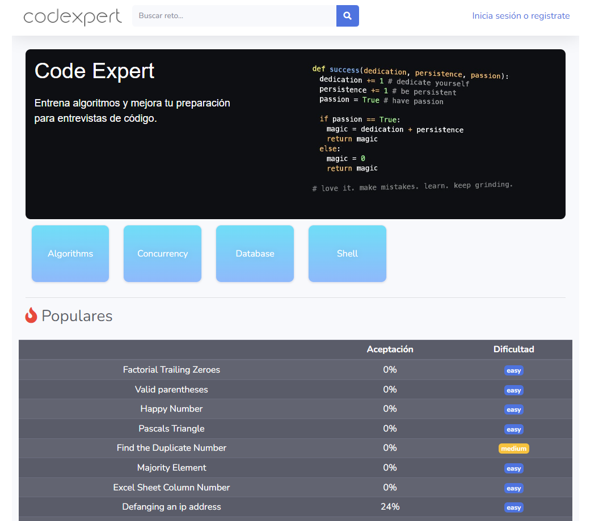

## Django App to solve algorithm problems (similar to Leetcode)




## Run the project

You can run the app by running `docker-compose up`. It will live-reload while developing.

```
docker-compose up
```

## What can you find in this app?


This project uses Docker-compose to start 3 containers:

* Django-App
* MySQL
* Redis
